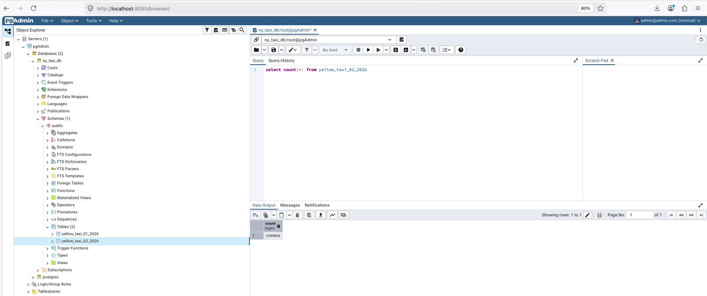

# 👨‍💻 postgres-pgadmin-codespaces

Containerized PostgreSQL and pgAdmin for structured data ingestion.

## 📂 Dataset Overview

This project uses the **NYC Taxi Trip Record Datasets**, originally
sourced from the official [TLC Trip Record Data](https://www.nyc.gov/site/tlc/about/tlc-trip-record-data.page) page.

### Data Source & Content

The dataset contains trip records for **Yellow** and **Green** taxis in New York City. It includes detailed information for each trip, such as:

- Pickup and drop-off dates and times
- Pickup and drop-off locations
- Trip distances
- Itemized fares (breakdown of costs)
- Rate types
- Payment types
- Driver-reported passenger counts

### Timeframe & Original Format

The data covers trips from **2004 through 2006**. It was originally downloaded in **Parquet** format from the official source.

### Processing & Availability

For ease of use in this project, the data was:

1. Converted from Parquet to **CSV** format.
2. Compressed into **GZ** files.

The copy of this dataset is hosted in the [NYC Taxi Dataset repository](https://github.com/tantikristanti/Datasets/tree/main/nyc-taxi-dataset) for direct access.

## ❓ How to Run the Data Ingestion Pipeline?

### Step 0: Clone this Repo, Initialize a Project, and Install Requirements

***Clone this repository***
```bash
git clone https://github.com/tantikristanti/postgres-pgadmin-codespaces.git
```

***Initialize project with UV***
We'll initialize a project in the working directory.

```bash
cd postgres-pgadmin-codespaces
uv init
```

> `uv` will create the following files:

.
├── .venv
│   ├── bin
│   ├── lib
│   └── pyvenv.cfg
├── .python-version
├── README.md
├── main.py
├── pyproject.toml
└── uv.lock

***Activate the environment variable***
```bash
source .venv/bin/activate
```

***Install requirements***

```bash
uv add -r requirements.txt
```

### Step 1: Run the Postgres and pgAdmin Containers

```bash
docker-compose up
```

### Step 2: List the Running Containers

```bash
docker ps
```

> **There should be two containers running: Postgres and pgAdmin**

```
CONTAINER ID   IMAGE            COMMAND                  CREATED          STATUS          PORTS                                         NAMES
23af20283a28   postgres:18      "docker-entrypoint.s…"   10 minutes ago   Up 10 minutes   0.0.0.0:5431->5432/tcp, [::]:5431->5432/tcp   postgres
69cfc033f18f   dpage/pgadmin4   "/entrypoint.sh"         10 minutes ago   Up 10 minutes   0.0.0.0:8085->80/tcp, [::]:8085->80/tcp       pgadmin
```

### Step 3: Create a Docker Image (containing the configuration and code in data-ingestion.py)

```bash
# Build the image with a name and tag
docker build -t nyc-taxi-data-ingest:v001 .

# Verify the created image 
docker images | grep nyc-taxi-data-ingest
```

### Step 4: Run the Data Ingestion Container

```bash
docker run -it --rm --env-file=.env-docker \
--network=postgres-pgadmin-codespaces_postgres_network \
nyc-taxi-data-ingest:v001 \
--url "https://github.com/tantikristanti/Datasets/releases/download/v1.0.0-yellow-alpha/yellow_tripdata_2026-02.csv.gz" \
--target_table yellow_taxi_02_2026 \
--chunksize=50000
```

### Step 5: Check the results in pgAdmin

- Access pgAdmin at `http://localhost:8085/`.
- Log in with your username `admin@admin.com` and password `root`.
- Data can be found in `Servers --> pgAdmin --> Databases --> ny_taxi_db --> Schemas --> public --> Tables`


